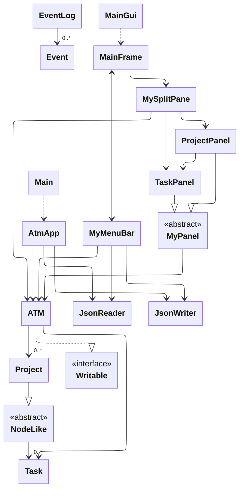

# Atomic Task Meter

- track task duration & build daily agenda
- plan study schedules, schoolwork, and projects 

---
## Overview 

**Atomic Task Meter** is a lightweight, offline desktop application that allows users to track tasks related to multiple project profiles simultaneously. 

Different from most to-do list applications, the Atomic Task Meter is designed for uses that emphasize completing big projects by:
- breaking them down into atomic-sized tasks, and
- assigning them to a daily agenda *(under development)*, and 
- tracking and comparing the time planned versus actually taken to finish them.

While allowing flexibility by not requiring users to time-block tasks on the calendar.  

## Project Background

I have been planning my daily tasks for years. This technique has allowed me to complete my schoolwork and routines on time without fear of missing deadlines or falling behind schedule.

However, most applications currently available on the market can be categorized into one of two types, and both of them have their own 
limitations:
- simple to-do list:  Overwhelming to read for a large amount of tasks nested into different projects and sub-projects. Especially when they span a long time period.
- calendar task blocks: Vulnerable to delays and changes, which is common in daily life. 

On top of that, most applications do not provide time-tracking functionality or cannot compare it with the planned time. In my opinion, such an evaluation process is crucial to improving personal workflow, hence increasing productivity. 

The purpose of this project is to address these issues. 

## User stories
(for TA grading)

As a user, I want to be able to:
1. make multiple subjects with their name and add them into the "collection of subjects"
2. read all subjects in the collection
3. remove a subject from the collection
4. mark a task as done
5. stop the timing and save all current projects/tasks when I want to save and quit the program
6. resume my saved projects/tasks when I enter the program and open my last save

## Instructions for End User

- You can add multiple `Projects` to the `Project list` by...
    1. Typing a project name in the text bar (bottom of the **left** panel)
    2. Clicking the "plus" button
    3. The new project will be listed in the left panel
    4. Repeat as needed to add multiple projects
- You can view all `Tasks` within a specific `Project` by... 
    - the first required action related to the user story "adding multiple Xs to a Y"
    1. Click on a project to select it (the **left** panel)
    2. Tasks within the project are automatically retrieved and displayed on the **right** panel 
- You can remove a `Project` by...
    - the second required action related to the user story "adding multiple Xs to a Y
    1. Click on a project to select it (the **left** panel)
    2. Click on the "trash" button
    3. Repeat as needed to remove multiple projects
- You can locate my visual component by...
    - the "plus" button on both left and right panel. The "plus" sign is an image (stored in `data/`), NOT an emoji.
- You can save the state of my application by...
    1. Click `File` in the menu bar
    2. Click `save` in the drop down menu
- You can reload the state of my application by...
    1. Click `File` in the menu bar
    2. Click `load` in the drop down menu


## Citation
- https://docs.oracle.com/javase/tutorial/uiswing/examples/components/index.html

## Class diagram source code



## Phase 4: Task 2

**Action**
```
make project: stat 201
make project: cpsc 110
make project: cpsc 210
remove project: cpsc 110
add task in cpsc 210: do project p3
add task in cpsc 210: do project p4
add task in stat 201: study midterm
remove task from cpsc 210:  do project p3
save
```
**Log**
```
Thu Mar 27 15:58:49 PDT 2025
Project stat 201 added
Thu Mar 27 15:58:55 PDT 2025
Project cpsc 110 added
Thu Mar 27 15:59:00 PDT 2025
Project cpsc 210 added
Thu Mar 27 15:59:03 PDT 2025
Project cpsc 110 removed
Thu Mar 27 15:59:33 PDT 2025
Task do project p3 added in project cpsc 210
Thu Mar 27 15:59:37 PDT 2025
Task do project p4 added in project cpsc 210
Thu Mar 27 15:59:54 PDT 2025
Task study midterm added in project stat 201
Thu Mar 27 16:00:08 PDT 2025
Task do project p3 removed from project cpsc 210
Thu Mar 27 16:00:12 PDT 2025
data saved
```